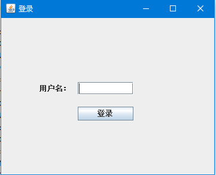
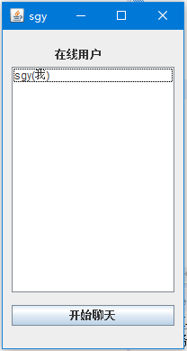
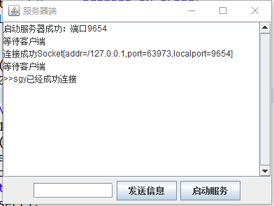

# 简单描述：
用Java语言开发的，基于socket通信开发的聊天小程序
## 功能：
* 单对单聊天
* 群聊
## 环境：
* JavaSE-1.8
* MySQL57
* c3p0-0.9.2
## 使用
* 安装数据库，执行 database.sql 文件
* 运行 ServerUI.java
* 运行 LoginUI.java
## 运行界面
* 登录窗口

* 用户窗口

* 服务器窗口
